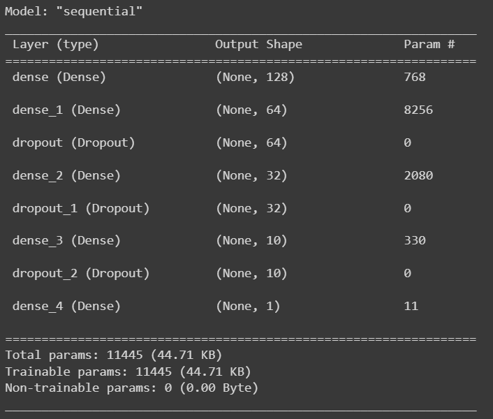

# IncomeifyApp-CH2-PS161 (Machine Learning)
This branch contains the following contents from the Machine Learning team:
1. Dataset: [Job Salary Indonesia](https://www.kaggle.com/datasets/canggih/jog-description-and-salary-in-indonesia?select=train.csv)
   
2. Data Preprocessing
    - Delete unnecesary columns, duplicate columns, and null columns
    - Remove outlier
    - Label encoding
    - Normalized dataset
    
3. Build a model
   
   
4. Train Dataset
6. Testing a model
